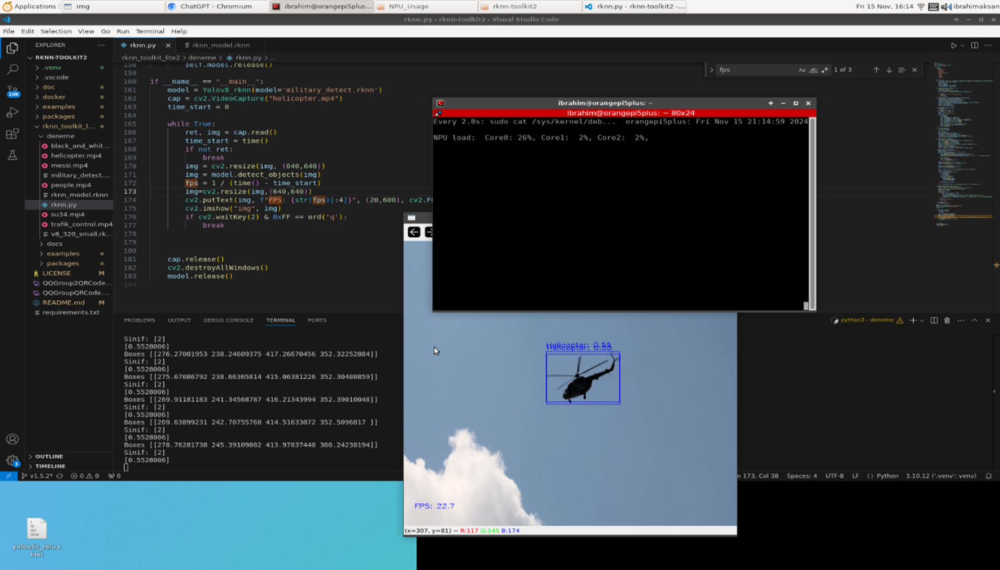
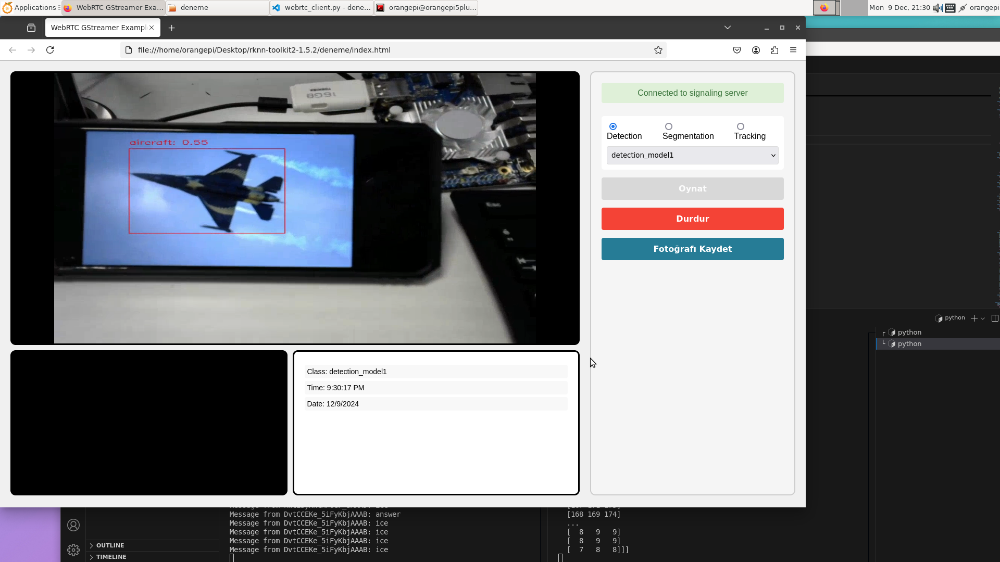
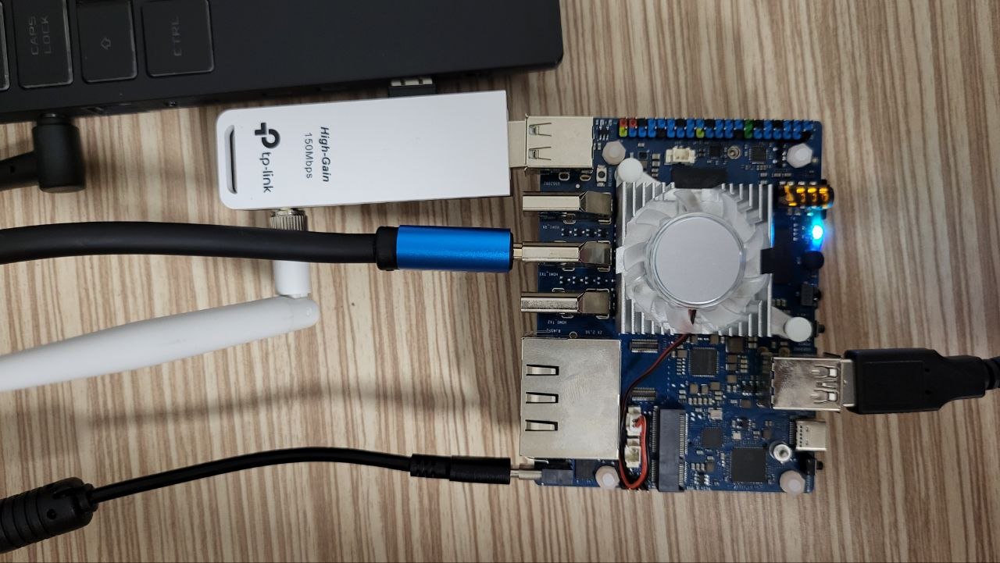

# ÇEKİRGE: Görüntü ve Sensör Tabanlı Akıllı Topraksız Tarım  
**ARA RAPOR**

## Proje Konusu
Bu proje, topraksız tarım yapılan bir ortamda görüntü işleme ve IoT teknolojilerini bir araya getirerek bitki sağlığını takip eden ve uzaktan izlenebilir bir sistem geliştirmeyi amaçlamaktadır. Sistem, kamera görüntülerini analiz ederek bitki üzerindeki anormallikleri (sararma, solma vb.) tespit ederken; çevresel sensörler ile sıcaklık, nem gibi faktörleri takip etmeyi hedefler. Böylece üreticilere erken müdahale imkânı sunulacaktır.

---

## Şu Ana Kadar Yapılanların Özeti  
Şu anda projede Rockchip tabanlı gömülü bir sistem, bir adet yüksek çözünürlüklü kamera ve ilerleyen aşamalarda entegre edilecek çeşitli sensörler ile bir yapı kurulmuştur. Görüntü işleme tarafında, YOLOv8s nesne tanıma modeli kullanılmış ve Rockchip’in yerleşik NPU biriminden faydalanmak üzere **RKNN Toolkit** ile optimize edilmiştir. Kamera görüntüsü gerçek zamanlı olarak GStreamer ve WebRTC teknolojileriyle tarayıcıya aktarılmakta, böylece uzaktan canlı izleme sağlanmaktadır. İlerleyen aşamalarda kullanıcı etkileşimli bir backend tasarımına gidilecek ve sensörlerden elde edilen veriler ile makine öğrenmesi analizi yapılıp bitki hakkında tam bilgi sahibi olunacaktır. Başta da belirtildiği üzere canlı görüntü aktarımı ve belirli zamanlarda görüntü alımı yapılarak inference adımı gerçekleştirilmiştir.

---

## Kullanılan Yöntemler

### Donanım  
| Bileşen | Açıklama |
|--------|----------|
| **Rockchip RK3588** | NPU destekli gömülü bilgisayar sistemi |
| **USB Kamera** | Yüksek çözünürlüklü görüntü alımı |
| **(Planlanan) Sensörler** | Sıcaklık, nem, ışık, pH ölçümü için çeşitli sensörler |

### Yazılım  
| Bileşen | Açıklama |
|--------|----------|
| **Python** | Görüntü işleme ve sistem yönetimi |
| **YOLOv8s (Ultralytics)** | Görüntüden bitki sağlığı analizi |
| **RKNN Toolkit** | YOLOv8s modelini RKNN formatına dönüştürme ve NPU üzerinde çalıştırma |
| **GStreamer** | Kamera görüntüsünün sıkıştırılması ve ağ üzerinden aktarımı |
| **WebRTC** | Düşük gecikmeli tarayıcıya canlı video aktarımı |

---

## Yapılan Teknik Çalışmalar  

### Görüntü İşleme  
- YOLOv8s modeli `.pt` formatından `.onnx`’e, ardından `.rknn` formatına dönüştürülerek Rockchip NPU üzerinde çalıştırılabilir hale getirildi.  
- Modelin inference işlemi Python üzerinden test edildi, örnek görüntüler üzerinde başarılı sonuçlar alındı.  
- Gerçek zamanlı video akışına entegre etme süreci halen devam etmektedir.

📷 **NPU Kullanımı Görseli**  

### Video Yayını  
- USB kamera görüntüsü GStreamer ile alınarak sıkıştırılmış biçimde yayınlandı.  
- WebRTC üzerinden tarayıcıya canlı aktarım sağlandı, gecikme minimize edildi.  
- Web tabanlı istemci test ortamı başarıyla çalışmaktadır.

🌐 **Web'de Görüntüleme Örneği**  

### Sistem Durumu  
- 📸 Kamera → ✅ Kuruldu ve video alımı sağlandı  
- 📡 GStreamer → ✅ Çalışıyor, h264 sıkıştırma ile gecikmesiz aktarım test edildi  
- 🌐 WebRTC → ✅ Tarayıcıya canlı video aktarımı yapıldı  
- 🤖 YOLOv8s → ✅ RKNN modeline dönüştürüldü  
- ⚙️ NPU → ✅ Model inference işlemleri başarılı  
- 🌿 Sensörler → ⏳ Henüz entegrasyon yapılmadı
- ⚙️ NPU → ✅ Model inference işlemleri başarılı, ilerleyen aşamalarda **marul** bitkisinden alınan görseller ile hastalık tespiti yapılacaktır.  
- 🌿 Sensörler → ⏳ Donanımsal entegrasyon tamam, yazılımsal entegrasyon yapılmadı  
---

**Kurulu Sistem Görüntüsü**

---

## Karşılaşılan Sorunlar ve Çözümler  
- **Model Dönüştürme Uyumsuzlukları**  
  YOLOv8s modeli ONNX formatına başarıyla çevrilmiş olsa da, RKNN formatına dönüşümde bazı tensor uyumsuzlukları oluşmuştur. RKNN Toolkit versiyonu güncellenerek ve model küçük revizyonlarla yeniden eğitilerek bu sorun aşılmıştır.

- **GStreamer Kurulumu ve Format Uyumsuzlukları**  
  GStreamer pipeline'ı oluşturulurken kamera sürücüsü uyumu ve video formatı kaynaklı çeşitli hatalar alınmıştır. `v4l2src` ile doğru format parametreleri verilerek bu sorunlar giderilmiştir. Aynı zamanda pipe'da gerekli optimizasyonlar yapılarak yayın gecikmesi minimuma çekilmiştir.

---

## Projenin Devamında Yapılacaklar  
- YOLOv8s modelinin canlı video akışına entegre edilerek gerçek zamanlı bitki sağlığı tespiti yapılması  
- Sensörlerin (sıcaklık, nem, pH, EC/Tds) sisteme bağlanarak veri takibi ve eş zamanlı analiz (makine öğrenmesi teknikleri ile)
- Kullanıcı arayüzüne bitki sağlığına yönelik görsel uyarı ve durum raporları eklenmesi  
- Model doğruluğunun artırılması için özel dataset ile yeniden eğitilmesi
